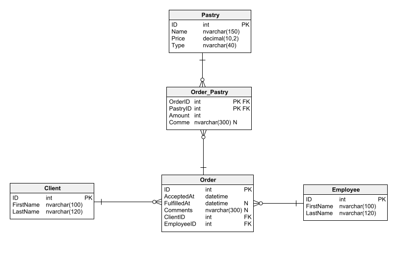

# Przykładowe kolokwium 2_1

Zadania powinny zostać wykonane w projekcie Web API z wykorzystaniem frameworka ORM – EntityFrameworkCore.

## Baza danych

Poniżej zaprezentowany jest diagram bazy danych wykorzystywanej w poniższych zadaniach.

Kolokwium powinno zostać zrealizowane na bazie lokalnej lub uczelnianej przy pomocy Entity Framework w wersji Core.

Należy zadbać o dodanie przykładowych danych do odpowiednich tabel.



## Końcówki

1. Zaprojektuj końcówkę, która będzie zwracać listę zamówień złożonych przez klienta o podanym nazwisku. Jeżeli nie zostanie przesłane nazwisko klienta należy zwrócić listę zawierającą zamówienia wszystkich klientów. Lista wynikowa nie musi zawierać informacji dotyczących pracownika, który był odpowiedzialny za przyjęcie zamówienia lub danych osobowych klienta. Musi natomiast uwzględnić co wchodziło w skład danego zamówienia (jakie wyroby cukiernicze były do niego wybrane). Pamiętaj o zwracaniu poprawnych kodów błędów.

   Końcówka powinna reagować na zapytanie pod adres `api/orders` np.
   `HTTP GET http://localhost:5000/api/orders`
   `HTTP GET http://localhost:5000/api/orders?clientLastName=Kowalski`

   Przykładowe dane jakie zostaną zwrócone:

   ```json
   [
     {
       "id": 1,
       "acceptedAt": "2023-05-25",
       "fulfilledAt": "2023-05-26",
       "comments": "Lorem ipsum dolor sit amet",
       "pastries": [
         {
           "name": "Donut",
           "price": 5.5,
           "amount": 3
         },
         {
           "name": "Croissant",
           "price": 13.49,
           "amount": 5
         }
       ]
     }
   ]
   ```

2. Zaprojektuj końcówkę, która pozwoli na dodanie nowego zamówienia. Powinna przyjmować informację podstawowe potrzebne do dodania zamówienia oraz kolekcję wyrobów cukierniczych, które powinny wejść w jego skład. Jeżeli został podany wyrób, którego nie ma w bazie należy przerwać przetwarzanie żądania i zwrócić odpowiedni status błędu. ID klienta składającego założenie powinno być podane jako część segmentu URL. Całe zadanie powinno zostać zrealizowane za pomocą jednej transakcji.
   Końcówka powinna reagować na zapytanie pod adres `api/clients` np.
   `HTTP POST http://localhost:5000/api/clients/1/orders`

   Przykładowe dane jakie są przesłane wraz z żądaniem:

   ```json
   {
     "acceptedAt": "2023-05-26",
     "comments": "Lorem ipsum dolor sit amet",
     "employeeID": 1,
     "pastries": [
       {
         "name": "Named birthday cake",
         "amount": 1,
         "comments": "The inscription on the cake: Happy Birthday!"
       },
       {
         "name": "Croissant",
         "amount": 5,
         "comments": null
       }
     ]
   }
   ```

## Punktacja

Każda końcówka jest wyliczana na **10 punktów**. Czyli za całość można zdobyć **20 punktów**.
Punkty mogą być odjęte za:

- Niepoprawne lub nieczytelne nazwy zmiennych: **-2 pkt**
- Niepoprawne kody HTTP: **-4 pkt**
- Brak wydzielenia komunikacji bazy danych do oddzielnego pliku/serwisu/repozytorium: **-10 pkt**
- Brak wstrzykiwania zależności: **-8 pkt**

## Uwagi

- Kod należy spushować na Github Classrooma. Rozwiązanie powinno zostać umieszczone na platformie
  **max. 5 min** po zakończeniu zajęć. Projekty umieszczone po czasie nie będą brane pod uwagę podczas
  sprawdzania (!)
- Kolokwium powinno być rozwiązane przy użyciu podejścia **Code-First**
- Rozwiązanie kolokwium bez tabel w bazie danych - **0 pkt**
- Rozwiązanie kolokwium bez przykładowych danych - **-50% punktów**
- Oddanie niekompilującego się kolokwium - **0 pkt**
- Wykrycie plagiatu - **2 z przedmiotu** bez możliwości poprawy
